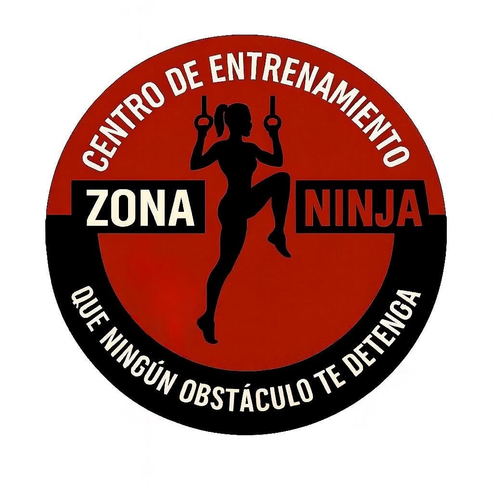

# Zona Ninja 🥷

Landing page para el **Centro de Entrenamiento Zona Ninja** — Funcional · Cross · OCR, ubicado en Guayaquil, Ecuador.

> "Que ningún obstáculo te detenga."

---

## 🖼️ Vista previa



---

## 📌 Sobre el proyecto

Diseño y desarrollo completo de una landing page para un gimnasio real, partiendo de un prototipo en **Figma** exportado con React + Vite + TailwindCSS, y refactorizado a **HTML, CSS y JavaScript puro** para máximo rendimiento y simplicidad de despliegue.

### Objetivo

Convertir un proyecto React/Vite de 60+ dependencias en un sitio estático profesional, mantenible y listo para producción — sin paso de build, sin frameworks.

---

## ⚙️ Stack tecnológico

| Tecnología | Uso |
|---|---|
| **HTML5 semántico** | Estructura: `<header>`, `<nav>`, `<main>`, `<section>`, `<article>`, `<footer>` |
| **CSS3** | Variables CSS, Flexbox, Grid, animaciones, Media Queries |
| **JavaScript vanilla** | Menú hamburguesa, smooth scroll, fade-in con IntersectionObserver |
| **Google Fonts** | Barlow + Barlow Condensed |
| **SVG inline** | Íconos sin dependencias externas |

**Sin frameworks. Sin npm. Sin paso de build.**

---

## ✨ Características técnicas

- **0 dependencias** — el sitio corre directamente en el navegador
- **Diseño responsivo** — Mobile · Tablet · Desktop con 3 breakpoints
- **Variables CSS** en `:root` para colores, fuentes y espaciados
- **Layout con Flexbox y Grid** — sin `position: absolute` abusivo
- **Accesibilidad** — atributos ARIA, jerarquía de headings correcta, `<time>` semántico
- **SEO optimizado** — `lang="es"`, meta description, Open Graph, Twitter Card
- **Rendimiento** — imágenes con `loading="lazy"`, fuentes con `preconnect`, JS diferido

---

## 🗂️ Estructura del proyecto

```
zona-ninja-github/
├── index.html          ← Página principal (HTML5 semántico)
├── css/
│   └── styles.css      ← Variables CSS + layout + animaciones + responsive
├── js/
│   └── main.js         ← Interacciones vanilla JS (~70 líneas)
├── assets/
│   └── img/
│       └── logo.png    ← Logo del gimnasio
├── .gitignore
└── README.md
```

---

## 📐 Secciones de la landing page

| # | Sección | Descripción |
|---|---|---|
| 1 | **Hero** | Imagen de fondo, slogan animado y CTA principal |
| 2 | **Ofrecemos** | Grid de 6 beneficios con íconos SVG y hover effects |
| 3 | **Planes** | Promo Fundadores (con tabla de precios) + Promo Entre Panas |
| 4 | **Horarios** | Horarios semanales con cards estilizadas |
| 5 | **Footer** | Links de contacto: WhatsApp, Instagram, Email y Ubicación |

---

## 🔄 Proceso de refactorización

El proyecto original fue exportado desde **Figma** como una app **React 18 + Vite + TailwindCSS v4** con más de 60 dependencias (Radix UI, MUI, Recharts, etc.), de las cuales el 99% no se utilizaba.

| Métrica | Antes (React/Vite) | Después (Estático) |
|---|---|---|
| Dependencias | 60+ paquetes | **0** |
| JS en producción | ~500 KB+ | **2.8 KB** |
| Paso de build | Sí (Vite + PostCSS) | **No** |
| SEO | `noindex, nofollow` ❌ | `index, follow` ✅ |
| `lang` HTML | `en` ❌ | `es` ✅ |

---

## 📞 Contacto del cliente

| Canal | Dato |
|---|---|
| WhatsApp | [+593 96 280 7366](https://wa.me/593962807366) |
| Instagram | [@zonaninjafit](https://instagram.com/zonaninjafit) |
| Email | zonaninjafit@gmail.com |
| Ubicación | Mucho Lote 2 — Cdla. Alameda del Río, Guayaquil |

---

© 2026 Zona Ninja. Todos los derechos reservados.
